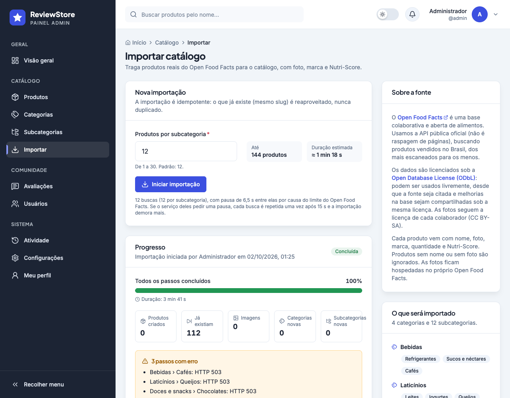
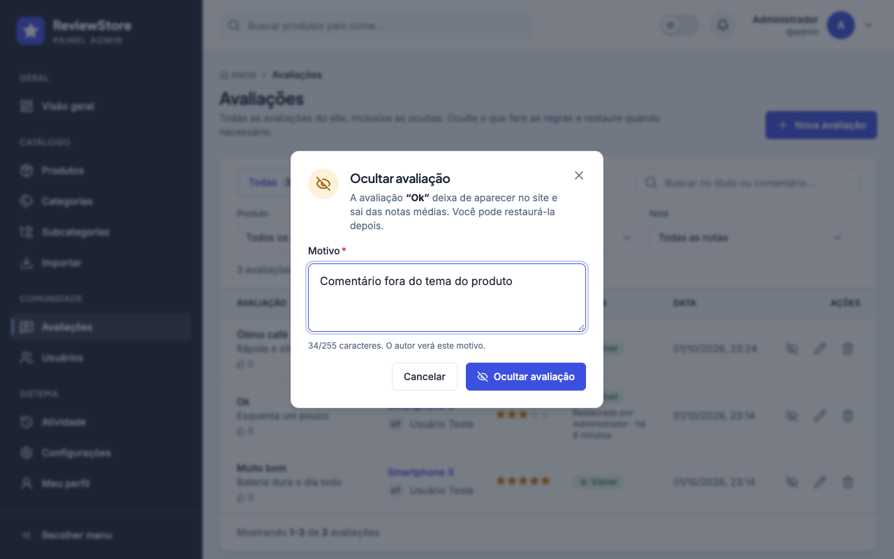
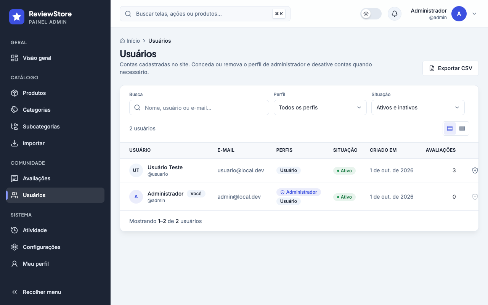
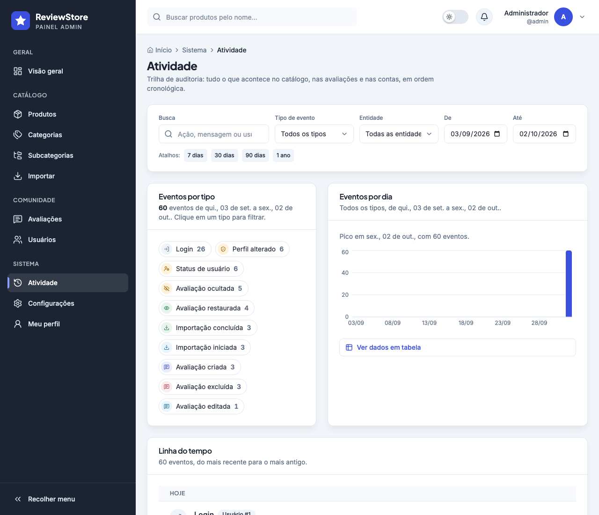
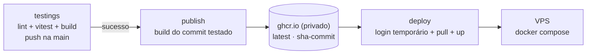
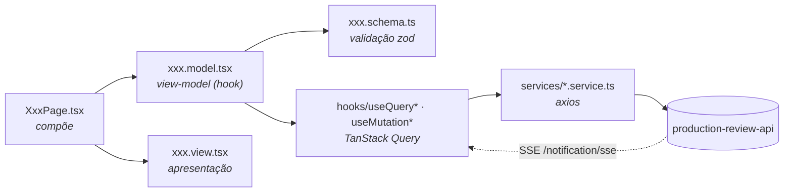

<div align="center">


# ReviewStore · Painel admin

**Painel administrativo do catálogo e das avaliações do ecossistema _Production Review_.**
Gerencie o catálogo, importe produtos reais do Open Food Facts, modere avaliações, administre usuários e acompanhe tudo em gráficos, na trilha de auditoria e em tempo real.

<p>
  
  
  
  
</p>
<p>
  
  
  
  
  
  
</p>

[Funcionalidades](#-funcionalidades) ·
[Telas](#-telas) ·
[Como rodar](#-como-rodar) ·
[Arquitetura](#-arquitetura) ·
[Acessibilidade](#-acessibilidade) ·
[Design system](#-design-system)

</div>

<br />

<p align="center">
  
</p>

---

## ✨ Funcionalidades

| | |
|---|---|
| 📊 **Visão geral com gráficos** | Totais (produtos, categorias, subcategorias, avaliações visíveis e ocultas, usuários), avaliações por dia com a nota média de cada dia, distribuição de notas, top 5 produtos e categorias e novos usuários por dia, com período de **7, 30 ou 90 dias**. |
| 📦 **Catálogo completo** | CRUD de categorias, subcategorias e produtos, com slug gerado automaticamente a partir do nome (e editável). Produtos com **miniatura, nota média**, filtros por categoria/subcategoria e ordenação (recentes, nome, melhor avaliados, mais avaliados). |
| 🖼 **Imagens de produto** | Galeria na edição do produto, com capa, origem (ex.: Open Food Facts) e **exclusão**; upload com validação de tipo e tamanho. |
| 📥 **Importar catálogo** | Importação do **Open Food Facts** (dados abertos, ODbL) com **progresso ao vivo**: barra, passo atual, contadores, erros e resumo com links. Idempotente: nada é duplicado. |
| 🛡 **Moderação de avaliações** | Abas *Todas · Visíveis · Ocultas* com contadores, filtros por produto, nota e texto, **ocultar com motivo obrigatório**, restaurar e quem moderou e quando. |
| 👥 **Usuários** | Busca, filtros por perfil e situação, **tornar/remover administrador** e **desativar/reativar** com confirmação. As ações sobre a própria conta ficam bloqueadas, com explicação. |
| 🕵️ **Atividade (auditoria)** | Linha do tempo de todos os eventos (cadastros, logins, catálogo, avaliações, moderação, importações) com ícone e cor por tipo, filtros por tipo, entidade, período e busca, resumo por tipo e por dia e links para a entidade. |
| 🔔 **Notificações em tempo real** | Cada nova avaliação chega via **SSE** com tipo do evento, data em que ocorreu e link direto, além de atualizar listas e gráficos. |
| 🔐 **Sessão segura** | Cookies `httpOnly`, renovação automática pelo refresh token e tela de **acesso restrito** para quem não é administrador. |
| 🌗 **Modo escuro** | Tema claro e escuro sincronizados em todo o painel, preferência salva no navegador. |
| 📱 **Responsivo** | Menu lateral recolhível no desktop e em gaveta no celular. |

## 🖼 Telas

<table>
  <tr>
    <td width="50%"></td>
    <td width="50%"></td>
  </tr>
  <tr>
    <td align="center"><sub><b>Produtos</b>: miniatura, nota, filtros e ordenação</sub></td>
    <td align="center"><sub><b>Importar catálogo</b>: Open Food Facts com progresso ao vivo</sub></td>
  </tr>
  <tr>
    <td width="50%"></td>
    <td width="50%"></td>
  </tr>
  <tr>
    <td align="center"><sub><b>Avaliações</b>: abas por status, filtros e ações</sub></td>
    <td align="center"><sub><b>Moderação</b>: ocultar exige motivo</sub></td>
  </tr>
  <tr>
    <td width="50%"></td>
    <td width="50%"></td>
  </tr>
  <tr>
    <td align="center"><sub><b>Usuários</b>: perfis, situação e ações</sub></td>
    <td align="center"><sub><b>Atividade</b>: resumo e linha do tempo</sub></td>
  </tr>
  <tr>
    <td width="50%"></td>
    <td width="50%"></td>
  </tr>
  <tr>
    <td align="center"><sub><b>Formulário</b>: seções, slug automático e validação</sub></td>
    <td align="center"><sub><b>Modo escuro</b>, inclusive nos gráficos</sub></td>
  </tr>
</table>

<p align="center">
  
</p>

## 🚀 Como rodar

### Pré-requisitos

- **Node.js 20+** e npm
- A API [`production-review-api`](https://github.com/erikomis/production-review-api) rodando (por padrão em `http://localhost:8084`)
- Um usuário com o perfil **ADMIN**

### Passo a passo

```bash
# 1. Instale as dependências
npm install

# 2. Aponte para a API
echo "VITE_API_URL=http://localhost:8084/api/v1" > .env.local

# 3. Suba em modo de desenvolvimento (http://localhost:5173)
npm run dev
```

### Scripts

| Comando | O que faz |
|---|---|
| `npm run dev` | Servidor de desenvolvimento com HMR na porta **5173** |
| `npm run build` | Checagem de tipos (`tsc -b`) + build de produção em `dist/` |
| `npm run preview` | Serve o build de produção localmente |
| `npm run lint` | ESLint em todo o projeto |
| `npm test` | Testes unitários com Vitest (slug, mensagens de erro, schemas, eventos de auditoria, status, progresso da importação e dados dos gráficos) |

### Variáveis de ambiente

| Variável | Exemplo | Descrição |
|---|---|---|
| `VITE_API_URL` | `http://localhost:8084/api/v1` | URL base da API, incluindo `/api/v1` |

## 🐳 Docker e deploy

As imagens são publicadas **privadas** no GitHub Container Registry: `ghcr.io/erikomis/dashboard-production-review-react`. A URL da API entra como `--build-arg VITE_API_URL`, porque o Vite embute o valor no bundle durante o build.

```bash
docker build --build-arg VITE_API_URL=http://localhost:8084/api/v1 -t dashboard-production-review-react .
docker run -p 5173:5173 dashboard-production-review-react   # http://localhost:5173
```



- **publish**: só roda depois que os testes do push na `main` passam; builda exatamente o commit testado e publica as tags `latest` e `sha-<commit>`, autenticando com o `GITHUB_TOKEN` do próprio workflow.
- **deploy**: entra na VPS por SSH, faz login no GHCR com o token temporário do job, sobe a imagem daquele commit e faz logout. **Nenhuma credencial fica salva na VPS.**

| Tipo | Nome | Para quê |
|---|---|---|
| Secret | `HOST`, `USERNAME`, `SSH_KEY` | Acesso SSH à VPS |
| Variável | `VITE_API_URL` | URL da API embutida no build (ex.: `https://api.seudominio.com/api/v1`). Sem ela, o publish falha com uma mensagem clara |
| Variável (opcional) | `DEPLOY_DIR` | Pasta do `docker-compose.yml` na VPS (padrão: `dashboard-frontend`) |

> [!IMPORTANT]
> Antes do primeiro deploy, copie o `docker-compose.yml` deste repositório para a pasta da VPS. Depois do primeiro publish, confira em **Perfil → Packages → dashboard-production-review-react → Package settings** que a visibilidade está **Private**.

## 🏛 Arquitetura

Cada tela segue **MVVM**: a view é puramente visual e toda a lógica fica no _view-model_ (um hook), que usa hooks do React Query e services para falar com a API.



```tsx
// Toda tela segue o mesmo formato
const EditCategoryPage = () => {
  const methods = useEditCategoryModel(); // lógica, estado, queries e handlers
  return <EditCategoryView {...methods} />; // só apresentação
};
```

<details>
<summary><b>📁 Estrutura de pastas</b></summary>

```text
src/
├── environment/            # configuração por ambiente (URL da API)
├── modules/
│   ├── auth/               # login, cadastro, ativação, esqueci/redefinir senha
│   └── dashboard/
│       ├── components/     # Sidebar, Header, PageHeader, StatCard, tabelas, formulários, gráficos, moderação
│       ├── hooks/          # queries, mutations, SSE de notificações, slug...
│       ├── schemas/        # schemas zod compartilhados do catálogo
│       ├── services/       # chamadas /category, /sub-categorie, /production, /review e /admin/*
│       ├── utils/          # lógica pura testada: eventos, status, progresso, gráficos, datas relativas
│       └── view/           # uma pasta por tela: home, *-list, create-*, edit-*, import-catalog,
│                           # users, activity, profile, settings
├── shared/                 # componentes, hooks, tipos, utilitários e preferências (tema)
├── ProtectedRouter.tsx     # guarda de rota: sessão + perfil ADMIN
└── routes.tsx
```

</details>

### Integração com a API

| Recurso | Endpoints |
|---|---|
| Categorias | `GET /category/list` · `GET/PUT/DELETE /category/{id}` · `POST /category/` |
| Subcategorias | `GET /sub-categorie/list` · `GET/PUT/DELETE /sub-categorie/{id}` · `POST /sub-categorie/create` |
| Produtos | `GET /production/list?search&categoryId&subCategorieId&onlyRated&property&sort` · `GET /production/{id}` · `POST /production/add` · `PUT /production/update/{id}` · `DELETE /production/delete/{id}` |
| Imagens | `POST /production/file` (multipart) · `DELETE /production/file/{id}` |
| Avaliações | `GET /review/list` · `GET/PUT/DELETE /review/{id}` · `POST /review/` |
| Moderação | `GET /admin/reviews?status&note&productId&search` · `PATCH /admin/reviews/{id}/moderation` |
| Usuários | `GET /admin/users?search&role&active` · `PATCH /admin/users/{id}/admin` · `PATCH /admin/users/{id}/active` |
| Estatísticas | `GET /admin/stats?days=7\|30\|90` |
| Importação | `POST /admin/import/open-food-facts` · `GET /admin/import/jobs/{id}` (polling a cada 2 s) · `GET /admin/import/jobs/latest` |
| Auditoria | `GET /admin/activity?type&entityType&search&from&to` · `GET /admin/activity/summary?from&to` |
| Tempo real | `GET /notification/sse` |
| Sessão | `POST /auth/sign-in` · `POST /auth/refresh-token` · `POST /auth/logout` · `GET /user/me` |

> [!NOTE]
> As rotas `/admin/*` exigem o perfil **ADMIN**. A auditoria passa pela API, que repassa para o serviço de logs; se ele estiver fora do ar, a tela mostra **“Serviço de auditoria indisponível”** com a opção de tentar novamente.

### Decisões de UX

- **Moderação dentro de Avaliações**, como abas *Todas · Visíveis · Ocultas*: é a mesma entidade e o administrador modera a partir da lista que já usa, sem alternar entre telas. `/dashboard/moderation` abre direto a aba *Ocultas*.
- **Nota média em gráfico separado**, alinhado pelo mesmo eixo de datas e com tooltips sincronizados: contagem e nota têm escalas diferentes, e dois eixos Y no mesmo gráfico sugeririam correlações que não existem.
- **Filtros na URL** (produtos, avaliações, usuários, atividade e período da visão geral): dá para compartilhar e voltar com o navegador sem perder o contexto.

## ♿ Acessibilidade

- **Formulários**: labels associados com indicação de obrigatório, erros ligados por `aria-describedby` + `aria-invalid` e foco automático no primeiro campo inválido.
- **Teclado**: foco sempre visível, link **"Pular para o conteúdo"**, menus com setas e <kbd>Esc</kbd>, e gaveta mobile que fecha com <kbd>Esc</kbd>.
- **Modal de confirmação**: `role="alertdialog"`, foco preso dentro do modal, <kbd>Esc</kbd> fecha e o foco volta para quem abriu.
- **Tabelas**: `<caption>` e `<th scope="col">`; botões só com ícone têm `aria-label` e tooltip.
- **Navegação**: `aria-current` no menu, breadcrumb e paginação; foco vai para o conteúdo a cada troca de rota.
- **Feedback**: `aria-live` em contadores, paginação e notificações; nota em estrelas como grupo de rádios.
- **Gráficos**: título, descrição, resumo em texto, `<title>`/`<desc>` no SVG e a tabela de dados em “Ver dados em tabela”; cores validadas para contraste e daltonismo nos dois temas.
- **Progresso e ações**: barra com `role="progressbar"` e `aria-valuetext`, e regiões `aria-live` para o passo da importação, a moderação e as ações em usuários.
- **Ações bloqueadas**: continuam focáveis (`aria-disabled`) para o tooltip explicar por que não estão disponíveis.
- **Contraste**: tokens dedicados para manter AA também no modo escuro, e `prefers-reduced-motion` respeitado.

## 🎨 Design system

Mesma identidade visual do [site ReviewStore](https://github.com/erikomis/dashboard-production-review-site): mesma marca, paleta e tipografia.

| Token | Cor | Uso |
|---|---|---|
| `primary` |  | Botões, links, item ativo e marca |
| `black` |  | Menu lateral e títulos |
| `body` |  | Texto auxiliar |
| `whiten` |  | Fundo da página |
| `boxdark` |  | Superfícies no modo escuro |
| `star` |  | Estrelas das avaliações e linha da nota média |

Nos gráficos, as barras usam `primary` no tema claro e `#6577F3` no escuro (o `primary` puro perde contraste sobre `boxdark`).

**Tipografia:** [Plus Jakarta Sans](https://fonts.google.com/specimen/Plus+Jakarta+Sans) nos títulos e [Inter](https://fonts.google.com/specimen/Inter) no texto.

## 🧩 Ecossistema Production Review

| Projeto | Descrição |
|---|---|
| [**production-review-api**](https://github.com/erikomis/production-review-api) | API REST em Spring Boot: autenticação, catálogo e avaliações |
| **production-review-api-logs** | Serviço de auditoria: consome os eventos do Kafka e grava no MongoDB (lido pela tela Atividade via API) |
| [**dashboard-production-review-site**](https://github.com/erikomis/dashboard-production-review-site) | Site público onde as pessoas avaliam produtos |
| [**dashboard-production-review-react**](https://github.com/erikomis/dashboard-production-review-react) | Este repositório: painel administrativo |

<div align="center">
<br />
<sub>Feito com ☕ e TypeScript.</sub>
</div>
