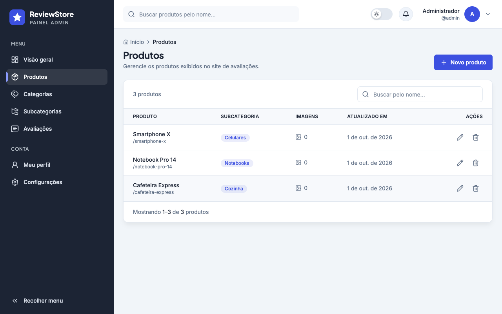
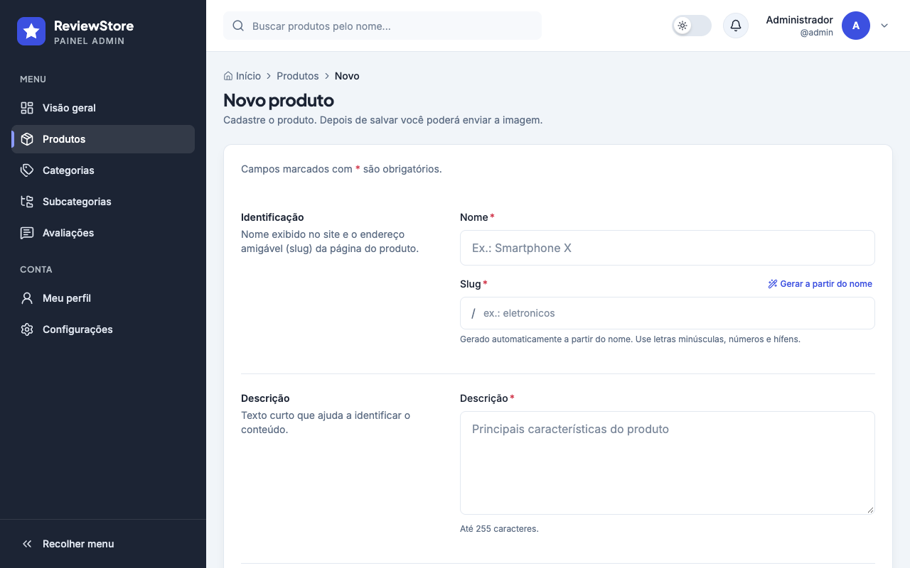
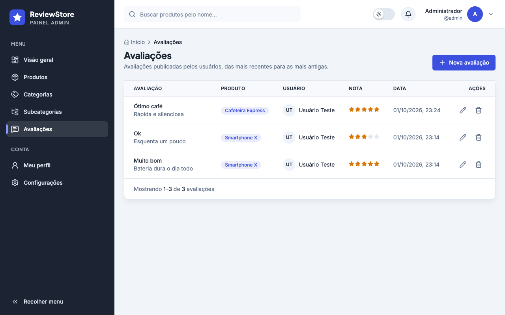
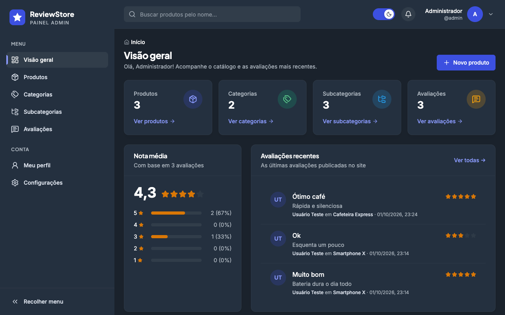
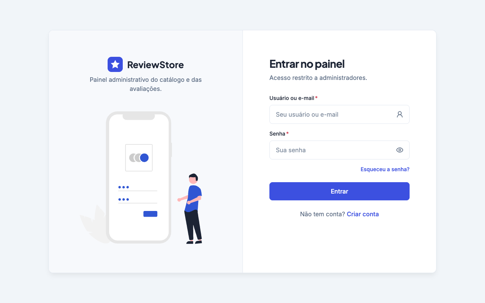
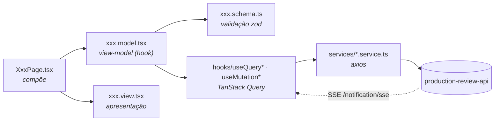

<div align="center">


# ReviewStore · Painel admin

**Painel administrativo do catálogo e das avaliações do ecossistema _Production Review_.**
Gerencie categorias, subcategorias, produtos e avaliações, e acompanhe tudo em tempo real.

<p>
  
  
  
  
</p>
<p>
  
  
  
  
  
</p>

[Funcionalidades](#-funcionalidades) ·
[Telas](#-telas) ·
[Como rodar](#-como-rodar) ·
[Arquitetura](#-arquitetura) ·
[Acessibilidade](#-acessibilidade) ·
[Design system](#-design-system)

</div>

<br />

<p align="center">
  
</p>

---

## ✨ Funcionalidades

| | |
|---|---|
| 📊 **Visão geral** | Totais de produtos, categorias, subcategorias e avaliações, nota média com distribuição e as avaliações mais recentes. |
| 📦 **Catálogo completo** | CRUD de categorias, subcategorias e produtos, com slug gerado automaticamente a partir do nome (e editável). |
| 🖼 **Imagens de produto** | Upload com validação de tipo e tamanho direto na edição do produto. |
| 💬 **Moderação de avaliações** | Lista paginada com produto, autor, nota e data, e edição ou exclusão. |
| 🔔 **Notificações em tempo real** | Cada nova avaliação chega via **SSE**, com aviso na tela e atualização automática da lista. |
| 🔐 **Sessão segura** | Cookies `httpOnly`, renovação automática pelo refresh token e tela de **acesso restrito** para quem não é administrador. |
| 🌗 **Modo escuro** | Tema claro e escuro sincronizados em todo o painel, preferência salva no navegador. |
| 📱 **Responsivo** | Menu lateral recolhível no desktop e em gaveta no celular. |

## 🖼 Telas

<table>
  <tr>
    <td width="50%"></td>
    <td width="50%"></td>
  </tr>
  <tr>
    <td align="center"><sub><b>Produtos</b>: busca, badges e ações</sub></td>
    <td align="center"><sub><b>Formulário</b>: seções, slug automático e validação</sub></td>
  </tr>
  <tr>
    <td width="50%"></td>
    <td width="50%"></td>
  </tr>
  <tr>
    <td align="center"><sub><b>Avaliações</b>: produto, autor e nota</sub></td>
    <td align="center"><sub><b>Modo escuro</b></sub></td>
  </tr>
</table>

<p align="center">
  
</p>

## 🚀 Como rodar

### Pré-requisitos

- **Node.js 20+** e npm
- A API [`production-review-api`](https://github.com/erikomis/production-review-api) rodando (por padrão em `http://localhost:8084`)
- Um usuário com o perfil **ADMIN**

### Passo a passo

```bash
# 1. Instale as dependências
npm install

# 2. Aponte para a API
echo "VITE_API_URL=http://localhost:8084/api/v1" > .env.local

# 3. Suba em modo de desenvolvimento (http://localhost:5173)
npm run dev
```

> [!TIP]
> Todo cadastro novo recebe o perfil `USER`. Para transformar um usuário em administrador, associe-o ao perfil `ADMIN` no banco:
> ```sql
> INSERT INTO users_roles (user_id, role_id)
> SELECT u.id, r.id FROM user u, role r WHERE u.username = 'seu-usuario' AND r.name = 'ADMIN';
> ```

### Scripts

| Comando | O que faz |
|---|---|
| `npm run dev` | Servidor de desenvolvimento com HMR na porta **5173** |
| `npm run build` | Checagem de tipos (`tsc -b`) + build de produção em `dist/` |
| `npm run preview` | Serve o build de produção localmente |
| `npm run lint` | ESLint em todo o projeto |
| `npm test` | Testes unitários com Vitest (slug, mensagens de erro e schemas) |

### Docker

```bash
docker compose up --build   # build com Node + Nginx servindo em http://localhost:5173
```

### Variáveis de ambiente

| Variável | Exemplo | Descrição |
|---|---|---|
| `VITE_API_URL` | `http://localhost:8084/api/v1` | URL base da API, incluindo `/api/v1` |

## 🏛 Arquitetura

Cada tela segue **MVVM**: a view é puramente visual e toda a lógica fica no _view-model_ (um hook), que usa hooks do React Query e services para falar com a API.



```tsx
// Toda tela segue o mesmo formato
const EditCategoryPage = () => {
  const methods = useEditCategoryModel(); // lógica, estado, queries e handlers
  return <EditCategoryView {...methods} />; // só apresentação
};
```

<details>
<summary><b>📁 Estrutura de pastas</b></summary>

```text
src/
├── environment/            # configuração por ambiente (URL da API)
├── modules/
│   ├── auth/               # login, cadastro, ativação, esqueci/redefinir senha
│   └── dashboard/
│       ├── components/     # Sidebar, Header, PageHeader, StatCard, tabelas, formulários
│       ├── hooks/          # queries, mutations, SSE de notificações, slug...
│       ├── schemas/        # schemas zod compartilhados do catálogo
│       ├── services/       # chamadas /category, /sub-categorie, /production, /review
│       └── view/           # uma pasta por tela: home, *-list, create-*, edit-*, profile, settings
├── shared/                 # componentes, hooks, tipos, utilitários e preferências (tema)
├── ProtectedRouter.tsx     # guarda de rota: sessão + perfil ADMIN
└── routes.tsx
```

</details>

### Integração com a API

| Recurso | Endpoints |
|---|---|
| Categorias | `GET /category/list` · `GET/PUT/DELETE /category/{id}` · `POST /category/` |
| Subcategorias | `GET /sub-categorie/list` · `GET/PUT/DELETE /sub-categorie/{id}` · `POST /sub-categorie/create` |
| Produtos | `GET /production/list` · `GET /production/{id}` · `POST /production/add` · `PUT /production/update/{id}` · `DELETE /production/delete/{id}` |
| Imagens | `POST /production/file` (multipart) · `DELETE /production/file/{id}` |
| Avaliações | `GET /review/list` · `GET/PUT/DELETE /review/{id}` · `POST /review/` |
| Tempo real | `GET /notification/sse` |
| Sessão | `POST /auth/sign-in` · `POST /auth/refresh-token` · `POST /auth/logout` · `GET /user/me` |

## ♿ Acessibilidade

- **Formulários**: labels associados com indicação de obrigatório, erros ligados por `aria-describedby` + `aria-invalid` e foco automático no primeiro campo inválido.
- **Teclado**: foco sempre visível, link **"Pular para o conteúdo"**, menus com setas e <kbd>Esc</kbd>, e gaveta mobile que fecha com <kbd>Esc</kbd>.
- **Modal de confirmação**: `role="alertdialog"`, foco preso dentro do modal, <kbd>Esc</kbd> fecha e o foco volta para quem abriu.
- **Tabelas**: `<caption>` e `<th scope="col">`; botões só com ícone têm `aria-label` e tooltip.
- **Navegação**: `aria-current` no menu, breadcrumb e paginação; foco vai para o conteúdo a cada troca de rota.
- **Feedback**: `aria-live` em contadores, paginação e notificações; nota em estrelas como grupo de rádios.
- **Contraste**: tokens dedicados para manter AA também no modo escuro, e `prefers-reduced-motion` respeitado.

## 🎨 Design system

Mesma identidade visual do [site ReviewStore](https://github.com/erikomis/dashboard-production-review-site): mesma marca, paleta e tipografia.

| Token | Cor | Uso |
|---|---|---|
| `primary` |  | Botões, links, item ativo e marca |
| `black` |  | Menu lateral e títulos |
| `body` |  | Texto auxiliar |
| `whiten` |  | Fundo da página |
| `boxdark` |  | Superfícies no modo escuro |
| `star` |  | Estrelas das avaliações |

**Tipografia:** [Plus Jakarta Sans](https://fonts.google.com/specimen/Plus+Jakarta+Sans) nos títulos e [Inter](https://fonts.google.com/specimen/Inter) no texto.

## 🧩 Ecossistema Production Review

| Projeto | Descrição |
|---|---|
| [**production-review-api**](https://github.com/erikomis/production-review-api) | API REST em Spring Boot: autenticação, catálogo e avaliações |
| [**dashboard-production-review-site**](https://github.com/erikomis/dashboard-production-review-site) | Site público onde as pessoas avaliam produtos |
| [**dashboard-production-review-react**](https://github.com/erikomis/dashboard-production-review-react) | Este repositório: painel administrativo |

<div align="center">
<br />
<sub>Feito com ☕ e TypeScript.</sub>
</div>
